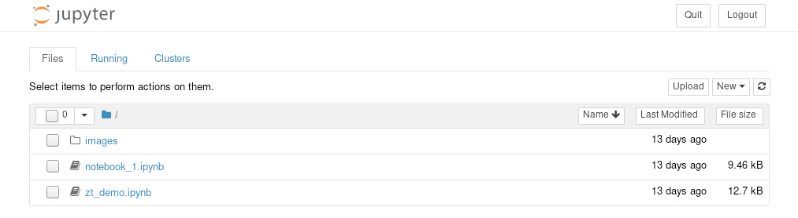

# Using Jupyter Notebooks with zTron
Once you have the Jupyter notebook configuration set, and a conda environment
created as outline in the [Jupyter setup](./jupyter_setup.md), starting and using
the notebook server is fairly simple:

- Navigate to the directory where you have your zTron pipeline notebooks.
- Activate your zTron conda environment
- Start the Jupyter notebook server
- Point a browser to the IP address and port number you configured in
  your ```jupyter_notebook_config.py``` using the token generate by Jupyter for
  authentication.

Here is an example:

```
[bash] /u/bostian> cd ztron/notebooks
[bash] /u/bostian/ztron/notebooks> conda activate ztron
(ztron) [bash] /u/bostian> jupyter notebook
[I 11:43:08.773 NotebookApp] Notebook authentication will be used.  The hashed password should be in the configuration file.
[I 11:43:09.073 NotebookApp] Serving notebooks from local directory: /u/bostian/ztron/notebooks
[I 11:43:09.073 NotebookApp] The Jupyter Notebook is running at:
[I 11:43:09.073 NotebookApp] http://x.xx.xx.xxx:9600/?token=tttttttttttttttttttttttttttttttttttttttttttttttt
[I 11:43:09.073 NotebookApp] Use Control-C to stop this server and shut down all kernels (twice to skip confirmation).
[C 11:43:09.076 NotebookApp]

    To access the notebook, open this file in a browser:
        file:///u/bostian/.local/share/jupyter/runtime/nbserver-50399951-open.html
    Or copy and paste one of these URLs:
        http://x.xx.xx.xxx:9600/?token=tttttttttttttttttttttttttttttttttttttttttttttttt
```

Now if you cut/paste the ```http://``` url displayed by the Jupyter server into
a web browser, you should see a list of notebooks you can run:


